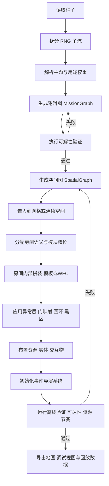

# 后室生成器种子逻辑与规则设计分析报告

## 执行摘要

本报告将“后室”从一个互联网怪谈设定，抽象成一个**可实现的生成系统问题**：不是先随机摆房间，再强行包装成后室；而是先定义“体验目标”，再把体验拆成**主题、拓扑、异常、资源、实体、事件、出口逻辑与节奏**几个层面，最后由种子统一驱动生成。Backrooms Wikidot 明确说明其并不存在唯一“真”设定，不同站点和作品有不同解释；同时，后室的核心共性仍然非常稳定：**熟悉但不对劲、空间巨大且反直觉、入口出口不稳定、资源有限、危险分层明显**。Level 0 的“单调迷宫”、Level 2/3 的“维护与设备空间”、Level 4/5 的“办公室/旅馆”、Level 37 的“泳池房”共同勾勒出一套可参数化的母体。citeturn6view11turn6view3turn6view5turn17view1turn17view2turn6view6

工程上，最稳妥的路线不是单一算法，而是**双层生成**：先生成**逻辑图**，再生成**空间图**。Dormans 与 Bakkes 的研究指出，适合探索型关卡的生成应将“任务/挑战结构”和“空间结构”分开处理；前者可由图文法或约束系统生成，后者再把逻辑结构翻译为可行走空间。对后室来说，这一点尤其重要，因为“可怕”并不只来自美术，而来自**路径不确定性、回环、错位、假出口与资源压力**如何共同作用。citeturn15view0turn14view2

在房间级生成上，本报告建议用**模板库 + 约束传播/WFC + 噪声/扰动层**。Wave Function Collapse 的官方说明强调，它适合从样例中提取局部模式，支持约束传播，并适合关卡生成；但它解决的是**局部合法性**，而不是全局可达性和恐怖节奏。因此，WFC 更适合作为“房间内部”和“局部片段”的装配器，而不是整个后室世界的唯一生成器。citeturn8view2turn8view3

事件系统不应走“满地脚本”的老路。Valve 在《Left 4 Dead》的公开设计资料中把可重玩性建立在**结构化的不确定性**、**峰谷式节奏**和**按情绪强度调节的事件/敌人分布**上，并明确指出过度依赖固定触发脚本会削弱悬念与合作。后室生成器同样应把“跳脸惊吓”降为次级机制，把**灯光波动、声学误导、门后错位、资源诱饵、假安全感**作为一级机制。citeturn20view0turn21view0turn21view1

综合以上资料，本报告给出的核心建议是：把种子设计为一个**体验种子**，而不是简单的随机数。种子至少应含有：主题、规模、模块列表、重复因子、错位因子、噪声种子、事件权重、连通矩阵、资源预算、光照谱、音效模板、怪物谱系、任务模板、情绪曲线，以及一组**字段依赖规则**。如果开发资源有限，优先级应为：**可解性与拓扑约束**，然后是**节奏与事件导演系统**，最后才是大规模美术多样性。citeturn15view0turn20view0turn6view2turn23search3

## 背景与目标

“后室”起源于 2019 年的 4chan 相关帖文，后来演化为多站点、多作者的协作文类。Backrooms Wikidot 的 FAQ 明确写明：后室并没有唯一权威站点，也没有单一规范宇宙；Levels、Entities、Objects 只是组织这类叙事的一种常见方式。对生成器设计来说，这意味着一个非常重要的工程前提：**不要把某一份 Wiki 当成唯一真值，而应提取跨版本稳定存在的体验不变量**。citeturn6view11turn3search1

本报告的目标是为一个“后室生成器（地图/房间生成器）”设计**种子生成逻辑与规则**。按用户要求，若没有明确指定用途，则标注为：**用途：未指定/通用**。这类生成器通常可服务于三种载体：游戏、影像和写作。它们共享同一套空间语义，但优化目标不同：游戏更重可达性、节奏和风险回报；影像更重镜头连续性、视觉记忆点和声画张力；写作更重叙事暗示、空间隐喻和事件解释余量。Procedural Dungeon Generation 的综述指出，PCG 既可以直接生成成品内容，也可以生成“中间草图”，再由设计者二次修整；这与后室生成器非常契合。citeturn6view2

从后室设定本身看，一个“Level”通常不是单个房间，而是**围绕统一主题组织起来的大型区域**。Backrooms Wiki 的旧版 Level Guide 将 level 定义为遵循统一主题的扩展区域，可能大到无限，也可能只是一小组房间；不同 level 的入口和出口会以不稳定、甚至突然变化的方式连接。这个定义非常适合拿来做生成器的上位抽象：**种子首先定义的不是房间列表，而是“一个主题化空间系统”**。citeturn18view0

后室的经典设计母体可以从几个代表层级里抽出来。Level 0 提供的是“重复、迷失、轻微变形、抬头是灯、低头是潮湿地毯”的范式；它会发生“Peripheral Shift”，也就是不被直视时布局可能扭曲、重排。Level 2/3 提供“设备与维护空间”的范式：狭窄、工业、角度规律但路径难懂、伴随持续机械噪声。Level 4/5 提供“熟悉功能空间失去功能”的范式：办公室和酒店看似完整，却由黑窗、陷阱、怪异声源和过度整洁感构成威胁。Level 37 则提供“非攻击性但异常”的范式：白瓷砖、温水、巨大的无用途空间和不合逻辑的照明。citeturn9view1turn9view3turn17view0turn17view1turn17view2turn9view4

因此，本报告建议把后室生成器的设计目标定成三条：其一，**稳定产出“像后室”的空间感**；其二，**稳定保证逻辑可用**，即不因随机化直接生成不可玩死图；其三，**允许不同媒介切换权重**，让同一套种子既能服务交互体验，也能服务镜头或文本叙事。MDA 框架强调，设计要从目标体验反推机制与动态；在后室问题上，这意味着你要先决定玩家/观众感受到的是“压抑、迷路、怀疑、短暂安全、突发失控”哪种曲线，再决定空间应该长成什么样。citeturn6view9

## 核心维度与可参数化属性

Backrooms Wiki 的层级、实体与物件资料显示，后室并不是“黄墙+怪物”这么简单，而是一个由**主题、危险、资源、实体与连接法则**共同构成的系统。Level 0 强调重复与漂移，Level 1 强调地标和资源箱，Level 3 强调高资源高危险，Level 4 强调低压补给与窗体陷阱，Level 5 强调声学与“被注视感”，Level 37 强调感官缓和与几何异常；同时，SD Class 把“安全性、安保性、实体数量”拆成三个维度，这对生成器非常有参考价值。下表据此把**可参数化属性**和**种子字段**统一成一张工程表。citeturn6view3turn16view2turn17view0turn17view1turn17view2turn9view4turn6view7

| 核心维度 | 可参数化属性 | 建议种子字段 | 数据类型 | 建议取值范围或分布 | 主要依赖规则 |
|---|---|---|---|---|---|
| 主题母题 | 办公、旅馆、维护、泳池、仓储、混合 | `theme_id` `theme_mix` | enum / array<float> | 单主题或 2–3 主题混合；混合权重总和=1 | 决定模块池、材质池、音景池 |
| 用途 | 游戏 / 影像 / 写作 / 通用 | `purpose` | enum | `game` `film` `writing` `generic` | 影响可达性约束与事件密度 |
| 规模 | 房间数、走廊长度、层级数、子区块数 | `room_budget` `edge_budget` `sublevel_count` | int | 房间 12–200；边≈房间-1 到 1.6x房间 | 与性能预算、探索时长绑定 |
| 视觉风格 | 色相、亮度、污损度、年代感、材质重复性 | `palette_seed` `wear_level` `era_profile` | int / float / enum | 污损度 0–1；年代建议离散枚举 | 与主题、危险、资源可见性关联 |
| 重复与单调 | 相似房间占比、局部重复周期、镜像率 | `repetition_factor` `motif_period` | float / int | `repetition_factor` 推荐 Beta(6,2)；经典后室偏高 | 高重复时必须提高差异线索密度 |
| 空间异常 | 错位、回环、视线外重排、口袋空间、比例失真 | `misalignment_factor` `anomaly_modes` | float / bitmask | 0–1；经典 Level 0/37 可偏中高 | 与出口可靠性、地图可读性强耦合 |
| 光照系统 | 色温、亮度方差、闪烁率、黑区比例、逆光率 | `light_spectrum` `flicker_rate` `blackout_ratio` | struct / float | 闪烁率 0–0.35；黑区 0–0.25 | 黑区升高时实体预算与音频提示同步调整 |
| 声学系统 | 底噪、混响、远端声源、误导声事件 | `audio_template` `hum_level` `reverb_profile` | enum / float / struct | `hum_level` 0–1；误导声间隔 20–180 秒 | 黑暗、长走廊、空旷房提高声学误导权重 |
| 功能性 | 房间“本来是做什么的”与“现在还能否工作” | `functional_profile` `decay_mode` | enum / enum | 办公/设备/后勤/旅馆/服务等；功能失效率 0–1 | 功能失效越高，越应保留少量残余痕迹 |
| 危险等级 | 安全、环境压迫、实体数、陷阱密度 | `danger_class` `hazard_mix` | int / struct | 可映射到 0–5 或三轴评分 | 与资源、出口、事件导演绑定 |
| 资源分布 | 饮水、照明、工具、钥匙、线索、假资源 | `resource_budget` `resource_rarity` | struct / float | 总预算建议与探索时长线性关联 | 高危险图必须给出最小生存资源下界 |
| 连通结构 | 分支率、回环率、死胡同比例、单向边比例 | `branch_factor` `loop_ratio` `dead_end_ratio` `one_way_ratio` | float | 分支 0.1–0.8；回环 0–0.35；死胡同 0.1–0.45 | 关键路径上不可形成不可逆软锁 |
| 出口逻辑 | 出口数量、可见性、稳定性、真假出口比例 | `exit_count` `exit_reliability` `false_exit_ratio` | int / float | 可靠性 0–1；假出口 0–0.6 | 低可靠性时需提供替代解或短循环补偿 |
| 事件系统 | 环境、空间、实体、叙事、资源、追逐 | `event_weights` `event_cooldowns` | map / map | 权重和=1；冷却 10–300 秒 | 受张力值、资源余量、区域语义调制 |
| NPC/实体 | 类型、刷新逻辑、栖息偏好、追逐策略 | `entity_family` `spawn_budget` `territory_rules` | enum[] / int / struct | 单图 0–3 主谱系最稳妥 | 黑区、狭窄区、假安全屋对实体偏好不同 |
| 可交互物件 | 门、灯、电话、电箱、货架、镜子、窗、录音机 | `interactable_pool` | enum[] | 每种房间 2–8 类交互物 | 必须与主题和事件可触发器一致 |
| 任务与进度 | 查找、穿越、修复、拍摄、收集、逃离 | `mission_template` `lock_key_profile` | enum / struct | 单局 1–3 主目标，若未指定可为空 | 用于游戏版；影像/写作可只保留叙事钩子 |
| 情绪曲线 | 压抑、迷失、缓和、恐慌、追逐、残响 | `mood_curve` `peak_count` | curve / int | 峰值 2–5；缓和段不应完全为零 | 由事件权重、资源压力和出口逻辑共同实现 |
| 随机控制 | 主随机种、子流、样例索引、噪声偏移 | `rng_master` `rng_streams` `noise_seed` | int / map | 64-bit 整数最稳妥 | 不同子系统必须可复现且可单独回放 |

这张表背后的核心思想很简单：**后室的“味道”不是一个字段，而是一组字段之间的依赖关系**。比如，黑区比例升高时，你不能只把灯关掉；还必须同步提高音景引导、降低远端假出口出现频率、增加近距地标密度，否则体验会从“恐怖迷失”直接跌成“纯粹瞎走”。同理，Level 4 型办公室若被定义为低危险补给区，就应按资料里那样提高补给和低实体概率；而 Level 3 型设备区则可以同时提高资源权重与高危事件权重，形成“高收益高风险”的空间语义。citeturn17view1turn17view0turn16view2

从后室文本气质看，最重要的不是花哨，而是“**略微不对**”。旧版 Level Guide 直接给出了一条非常有用的写作/设计准则：后室常见的成功方向是“熟悉、怀旧、但有点说不清哪里不对”，以及“事实口吻下的清晰危险信息”。把这条翻译成生成规则，就是：**大多数参数要允许小偏差，而不是总做大异常**。后室通常靠 5%–20% 的不合逻辑来持续施压，而不是靠 100% 的抽象超现实来吓人。citeturn18view0

## 种子结构设计

从实现角度看，建议把种子分成五层：**身份层、空间层、生态层、事件层、节奏层**。这与后室资料中“level—entity—object—entry/exit”的组织方式是一致的，也与现代 PCG 常见的“高层约束 + 低层拼装”方法一致。PCG 综述把方法分为搜索式、学习式、噪声式、文法式等；对后室生成器来说，最实用的是把这些方法放在不同层处理不同问题，而不是试图让一个模型通吃一切。citeturn6view1turn6view2

下面给出一个**推荐种子骨架**。它不是唯一标准，但足够让开发者直接编码：

```json
{
  "version": 1,
  "purpose": "generic",
  "theme": {
    "theme_id": "office_yellow",
    "theme_mix": {"office_yellow": 0.7, "utility": 0.3},
    "era_profile": "late_20th_century",
    "palette_seed": 894211,
    "wear_level": 0.42
  },
  "scale": {
    "room_budget": 48,
    "edge_budget": 61,
    "sublevel_count": 1,
    "expected_run_minutes": 28
  },
  "topology": {
    "branch_factor": 0.46,
    "loop_ratio": 0.18,
    "dead_end_ratio": 0.31,
    "one_way_ratio": 0.06,
    "exit_count": 2,
    "exit_reliability": 0.34,
    "false_exit_ratio": 0.22,
    "connectivity_mode": "non_euclidean"
  },
  "anomaly": {
    "repetition_factor": 0.78,
    "misalignment_factor": 0.54,
    "anomaly_modes": ["peripheral_shift", "offset_return", "door_remap"],
    "noise_seed": 11235813
  },
  "sensory": {
    "light_spectrum": {"cct": 4300, "variance": 0.16, "blackout_ratio": 0.08, "flicker_rate": 0.11},
    "audio_template": "fluorescent_hum",
    "hum_level": 0.73,
    "reverb_profile": "carpeted_low_ceiling"
  },
  "resources": {
    "resource_budget": {"water": 6, "battery": 4, "tool": 3, "key_item": 2, "lure": 3},
    "resource_rarity": 0.57,
    "fake_resource_ratio": 0.12
  },
  "entities": {
    "entity_family": ["smiler", "hound"],
    "spawn_budget": 5,
    "territory_rules": {"dark_preference": 0.81, "noise_response": 0.44}
  },
  "events": {
    "event_weights": {
      "ambient": 0.26,
      "structural": 0.21,
      "resource": 0.12,
      "deception": 0.17,
      "entity": 0.16,
      "chase": 0.08
    },
    "event_cooldowns": {"minor": 25, "major": 110},
    "state_persistence": true
  },
  "mission": {
    "mission_template": "find_exit_via_power_restore",
    "lock_key_profile": {"locks": 2, "keys": 2, "softlocks_allowed": 0}
  },
  "pacing": {
    "mood_curve": "slow_burn_3_peaks",
    "peak_count": 3,
    "recovery_floor": 0.22,
    "resource_pressure": 0.48
  },
  "rng": {
    "rng_master": 1572673819283,
    "rng_streams": {
      "layout": 101,
      "rooms": 202,
      "events": 303,
      "resources": 404,
      "entities": 505
    }
  }
}
```

字段取值建议方面，最关键的是三个因子：`repetition_factor`、`misalignment_factor` 和 `exit_reliability`。  
`repetition_factor` 建议使用**偏高分布**，因为后室的核心经历之一就是“看起来都一样”。Level 0 的单调重复与“everything blends together”的体验、Level 37 的一致瓷砖与无功能空间，都说明后室更依赖**高相似 + 小差异**，而不是高度多变。实作上，若你希望默认结果更像经典后室，可把该字段设为 Beta(6,2) 或三角分布 `[0.55, 0.8, 0.95]`。citeturn9view1turn9view4

`misalignment_factor` 建议使用**中值略高、尾部受限**的分布。原因很简单：后室需要错位感，但如果所有门都错位、所有环路都反常，玩家会迅速失去对世界的任何局部模型，体验就不再是“怀疑现实”，而会退化成“随机传送的不公平感”。Level 0 的描述表明重排并不是恒定发生，而是具有区域差异；Level 2 的资料也显示某些空间虽然复杂，却仍有可理解的几何共性。工程上，`misalignment_factor` 超过 0.7 时，应自动提高地标密度、降低假出口比例，或增加“稳定房间”作为参照。citeturn9view1turn9view3

`exit_reliability` 则决定了这张图究竟是“可逃离的迷宫”还是“叙事上近乎绝望的漂流”。Backrooms Wiki 多处提到入口出口会转移、消失，Level 4 甚至明确写到失去直视后出口可能消失；但 Guide 也提醒，如果一个 level 完全无人能离开，就很难形成可记录的层级叙述。换成生成规则就是：**出口低可靠是允许的，出口绝对不可用不应作为默认**。推荐把 0.25–0.65 作为常规区间；低于 0.25 时，最好只用于短局、影像场景或明确的“无解绝境”模式。citeturn17view1turn18view0turn6view4

字段依赖规则建议至少写成如下硬约束：

- 若 `danger_class >= 3`，则 `resource_budget.water + resource_budget.battery` 不得低于按预期时长计算的生存下界。
- 若 `one_way_ratio > 0`，则所有关键任务节点到至少一个有效出口必须存在有向可达路径。
- 若 `false_exit_ratio > 0.3`，则必须提高真实出口的环境线索强度，避免玩家完全失去校验机制。
- 若 `entity_family` 包含偏黑暗实体，例如 Smilers，则 `blackout_ratio` 或阴影覆盖必须达到其最低栖息阈值，否则会出现“设定上存在，体验上不存在”的空转。
- 若 `theme_mix` 含 `utility` 或 `electrical`，应提高 `audio_template` 中机械噪声占比，因为 Level 3 的恐怖显著来自持续嗡鸣和设备噪声叠加，而不是单纯贴图。citeturn7search0turn17view0

在实体和资源字段上，也应采用“谱系”而非“单怪名单”。实体列表页面说明，不同实体具有不同 habitat 和行为需求；例如 Smilers 偏暗区，Hounds 更适合转角、追逐与压迫，Skin-Stealers 更偏社会性欺骗与伪装。因此，`entity_family` 最好用**功能谱系**组织：`stalker`、`chaser`、`mimic`、`ambusher`、`territorial`。这样不但能兼容不同后室版本，也更方便直接落到 AI 行为树上。citeturn7search0turn7search1turn7search2turn7search4

## 随机化规则与地图约束

宏观地图生成建议采用**图论约束优先**的方式。具体来说，先生成一个逻辑图 `H=(Vh,Eh)`，表示目标、钥匙、门、供电点、避难点、出口这些“功能节点”；再生成空间图 `G=(Vs,Es)`，表示实际房间、走廊、楼梯、电梯和口袋空间；最后用映射 `φ: H -> P(G)` 把逻辑节点落到空间子图上。Dormans 与 Bakkes 明确主张把 mission 和 space 分开；这正好解决后室生成器里最容易翻车的问题：**看起来像后室，但实际上没法完成目标**。citeturn15view0

在 `H` 的生成上，最稳妥的方案是**图文法或约束图重写**。相关研究指出，图文法很适合表达锁钥、分支、回环和顺序任务，并且可以通过规则数量直接控制锁与钥匙的数量。后室生成器完全可以借鉴这一点，但把锁钥翻译得更“后室化”：传统钥匙可以变成“电力恢复”“静音穿越”“识别假门”“找到稳定房间坐标”等抽象钥匙。citeturn15view0turn19view1turn12search5

在 `G` 的生成上，建议使用以下硬约束：

**可达性约束**  
起点到所有关键节点必须可达；起点到至少一个真实出口必须可达；若存在单向边、坠落、封死门或层级切换，则必须进行有向图可达性校验。对游戏用途，关键任务节点后的不可逆门不能封住唯一回收路径；对影像/写作用途，可以允许更高比例的不可逆设计，但应在叙事层明示其“有去无回”。这一原则和图文法中“不要把钥匙放到锁后面”的可解性原则完全一致。citeturn12search5turn15view0

**回环与死胡同比例**  
后室不适合纯树状地图。推荐默认 `loop_ratio` 为 0.12–0.28，这样既能制造“好像回来过”的恍惚感，又不会让地图完全失去方向性。`dead_end_ratio` 推荐 0.18–0.40，用来安放假出口、资源诱饵、局部事件与强情绪小房间。Level 0 的 arch room、pillar room、red rooms 和 blackout zones，本质上都像“通用迷宫语法”上的特殊枝杈或局部区域，而不是独立地图逻辑。citeturn9view1

**层级切换规则**  
如果生成器支持“层内子层”或“口袋层”，推荐把层级切换边标成 typed edge，而不是普通门。`edge.type` 可分为 `normal`、`one_way`、`pocket`、`sublevel`、`phase_shift`。旧版 Guide 明确说明 levels 可以以突变或微妙融合的方式相连，也允许子层和 room 这种更小尺度的派生空间。对后室生成器而言，这意味着“切层”不是加载新地图，而是**切换一套连接法则**。citeturn18view0turn6view11

**门后空间映射规则**  
后室的经典效果来自“门是拓扑映射，不是建筑连接”。推荐提供六种门后映射模式：

1. `euclidean`：常规相邻房间。  
2. `offset`：回头不是原路，对应位置偏移。  
3. `cycle`：多门构成有限或无限环。  
4. `pocket`：门后是小口袋房，返回后落点改变。  
5. `collapse`：进入后原门失效或变墙。  
6. `conditional`：门结果依赖状态，例如断电、事件旗标、携带物件。  

Level 0 的 Peripheral Shift、Level 4 的“失去直视后出口可能消失”、Level 37 的“senseless manner”连接，都可自然映射到这套规则中。citeturn9view1turn17view1turn9view4

**局部拼装规则**  
当宏观图确定后，再进入房间与走廊的细部生成。这里推荐使用**样例驱动约束传播**。WFC 官方文档指出，它可以保证输出只使用样例中存在的局部模式，并适合 level generation；它还支持预约束，这意味着你可以把“必须有门洞”“必须留出实体巡逻位”“必须在灯下放办公桌残件”作为局部硬条件。建议把 WFC 只用于**房间内部网格、天花/灯具/材质/障碍拼装**，不要让它负责整个可玩关卡的全局拓扑。citeturn8view2turn8view3

**不可逆门与软锁规则**  
如果门一旦通过就封死，那么必须满足两条：一是门后区域要么包含新的目标推进，要么包含足够明确的“这是代价换推进”的反馈；二是门后区域不能要求玩家回收之前无法再获得的关键资源。这里非常适合做一个离线验证器：在每次生成完成后，模拟“最差资源消耗路径”和“普通路径”，分别检查是否存在软锁。近期关于统一关卡与游玩过程文法约束的论文也强调，图文法要显式编码“可完成性”，否则看似合法的图依然可能在游玩层面不成立。citeturn12search5turn15view0

## 事件系统与恐怖节奏

后室事件不应被视为“图上某点触发一个 scare”，而应被视为**状态驱动的世界反应**。建议把事件分成六类：环境事件、空间事件、资源事件、欺骗事件、实体事件、追逐/高潮事件。  
环境事件包含灯闪、嗡鸣变化、温度/水位变化、远端脚步或人声；空间事件包含门位重映射、回头后走廊重排、假窗/假出口变更；资源事件包含补给出现、补给消失、资源污染、假资源诱饵；欺骗事件包含“有人回应你”“电话响”“门后像有人呼吸”；实体事件包含窥视、跟踪、模仿、伪装、站位变化；追逐事件则用于节奏峰值。Level 1 的箱子会在某些条件下出现与消失，Level 4 的窗是陷阱，Level 5 的低音量 jazz 和墙后 chatter 会持续施加“有人在”的错觉，Level 3 的实体则更适合做高危峰值素材。citeturn16view2turn17view1turn17view2turn17view0

建议将事件概率写成一个可审计公式，而不是散在各脚本里。一个实用形式是：

```text
P(event_i) =
base_i
× zone_affinity_i
× tension_modifier_i
× novelty_decay_i
× persistence_gate_i
× purpose_modifier_i
```

其中 `zone_affinity_i` 由主题和房间语义决定，`tension_modifier_i` 由导演系统提供，`novelty_decay_i` 用于避免相同惊吓重复过快，`persistence_gate_i` 用于避免逻辑冲突，`purpose_modifier_i` 则用于切换媒介用途。这样做的好处是：同一类事件，比如“灯灭”，在游戏模式下可以更频繁且更功能化，在影像模式下可以更稀有但更戏剧化。Valve 的资料把这种做法称为结构化不确定性与自适应节奏，它的重点不是“纯随机”，而是“在设计好的一组可能性中按上下文择时出现”。citeturn20view0

后室尤其适合做**连锁事件**。例如：

- `flicker -> blackout -> distant_voice -> shadow_passes_door`
- `resource_find -> apparent_relief -> nearby_door_rewrites -> ambush`
- `false_exit_seen -> line_of_sight_break -> exit_disappears -> loop_reentry`
- `entity_hint -> silence -> mimic_voice -> chase`

这种连锁比单次 jump scare 更符合后室的体验逻辑，因为它用的是“怀疑—确认—失控”的链，而不是“平静—突然吓到”的点。Level 0 的 blackout zone 描述里就体现了这类机制：灯没了、嗡鸣消失、声音位置又变化，最终让人分不清方向。Level 5 也是类似：不是马上攻击，而是先让环境持续暗示“有人或某物在看你”。citeturn9view1turn17view2

状态持久化是后室事件系统的重点。建议至少保存四类状态：  
一类是**世界状态**，例如是否断电、哪些门已折叠、哪些出口已失效；  
一类是**区域状态**，例如某区是否已经发生过大事件、该区域还剩多少事件预算；  
一类是**实体状态**，例如某个 stalker 是否已经和玩家建立跟踪关系；  
最后一类是**玩家认知状态**，例如是否已经见过某假出口、是否已学会某类陷阱。  
如果不做持久化，后室会很快变成“房间里随机播特效”；做了持久化，它才会像一个**会记住你的空间**。这一点和 Valve 通过“情绪强度”调节人口与节奏、避免固定触发位置的做法高度一致。citeturn20view0turn21view1

恐怖节奏上，建议把全局张力值 `T` 设计成**锯齿上升的多峰曲线**，而不是单调拉高。Valve 的 AI Director 明确指出，持续不变的高强度会疲劳，长时间无事又会无聊；有效方法是制造不可预测但可控的峰谷。对后室生成器，可以定义：

- 基础压抑来自重复、底噪、长距离游走；
- 中等张力来自轻微错位、资源不足、真假出口；
- 峰值来自黑区、局部追逐、门后重映射或强实体事件；
- 缓和段必须存在，但不是“完全安全”，而是“暂时没有直接攻击”。citeturn21view0turn20view0

资源管理是调节节奏最便宜也最有效的方法。Almond Water 在多个层级里是典型资源；Level 1 的 crate 机制说明“资源出现”本身就是事件，甚至会在不看时消失。工程上可把资源拆成三类：**生存资源**、**导航资源**、**验证资源**。前者是水、电池、药剂；后者是地图碎片、稳定地标、临时标记器；验证资源则用于确认现实，例如门楔、照明弹、检测伪装的工具。这样一来，资源就不再只是回血包，而是后室最重要的“和空间博弈的工具”。citeturn6view8turn16view2turn17view0

## 测试样例与评估指标

为了让种子真正可开发、可回归、可调参，建议先准备一组覆盖不同体验目标的**标准种子库**。下面的 8 个示例并非固定答案，而是用于建立生成器的“已知输出区间”。表中字段值均为建议值，可直接作为初版测试集。其设计依据综合了后室层级母题、图文法关卡设计、空间探索代价函数与节奏导演思路。citeturn15view0turn14view1turn20view0turn23search4

| 种子 ID | 主题 | 关键字段值 | 预期体验 | 主要风险点 |
|---|---|---|---|---|
| BRS-A1 | 黄阈办公室 | `repetition=0.86` `misalignment=0.44` `loop=0.18` `exit_reliability=0.42` `entities=[]` | 强迷路、弱攻击、慢性不安 | 容易无聊；需靠细微差异支撑 |
| BRS-A2 | 黑区维护廊 | `theme=utility` `blackout=0.23` `hum=0.81` `danger=3` `smiler=1` | 听觉主导、短频高压 | 黑暗过多会影响公平性 |
| BRS-A3 | 设备站资源局 | `theme=electrical` `resource_budget_high` `danger=4` `spawn_budget=6` | 高收益高风险，进退两难 | 资源过肥会破坏恐怖节奏 |
| BRS-A4 | 空办公室补给层 | `theme=office_empty` `danger=1` `resource=high` `false_exit=0.18` | 假安全、补给、轻迷惑 | 过于安全会让后室味变淡 |
| BRS-A5 | 旅馆回声层 | `theme=hotel` `audio=quiet_jazz` `deception=0.31` `exit_reliability=0.28` | 被注视感、门后不确定 | 若缺少反馈，易觉得纯随机 |
| BRS-A6 | 泳池缓压错位层 | `theme=poolrooms` `misalignment=0.61` `entity=0` `mood=melancholic` | 美感与不适并存，方向感溶解 | 节奏可能太平，需要局部异动 |
| BRS-A7 | 混合办公维护层 | `theme_mix={office:0.5,utility:0.5}` `locks=2` `power_restore` | 任务驱动，体验最平衡 | 若逻辑图弱，会变成普通解谜图 |
| BRS-A8 | 假出口追逐层 | `false_exit=0.41` `one_way=0.12` `peak_count=4` `hound=1` | 强烈失控与撤离压迫 | 易软锁，必须严格验证 |

### 黄阈办公室

这是最接近经典 Level 0 的种子。玩家体验应是“走了很久，但几乎什么都没发生”，直到微小变化开始被注意到：灯位不同、地毯更湿、墙纸纹理少了半截。它的恐怖不来自怪，而来自单调、重排和“我是不是又回来了”。这个种子对**重复中的差异设计**要求最高。Level 0 本身就把“randomly segmented rooms”“mind-numbing monotony”“layout may warp”放在体验核心位置。citeturn6view3turn9view1

### 黑区维护廊

这个种子对应 Level 0 blackout zone、Level 2/3 维护区和 Smiler 栖息逻辑的混合版。主驱动力应该是听觉，而不是视觉：低电流声、远端金属震动、突然消失的嗡鸣，让玩家先不安，再确认黑暗里真的“有什么”。Smiler 只要很少量就够，因为黑暗与音景本身已经承担了大部分恐惧工作。citeturn9view1turn9view3turn17view0turn7search0

### 设备站资源局

这个种子借 Level 3 的“危险但富资源”逻辑。玩家会明显感到值得冒险：电箱区、工具柜、稀有补给、关键任务物都多，但高危实体、窄道与机械事故频繁出现。它适合验证你的生成器是否能同时处理“资源奖励”和“节奏代价”。Level 3 资料直接指出它拥有稀有资源、极高危险和复杂机械环境，这种配置天然适合做高收益高风险区。citeturn17view0

### 空办公室补给层

这个种子对应 Level 4。它不是主恐怖层，而是“可呼吸但不完全可信”的补给层。窗户应少量保留，并被定义成高威胁陷阱；资源稍丰厚，实体很少，出口相对好找。它的作用不是单独撑起整局，而是在大图中提供节奏缓和、物资回收和玩家重新建立空间模型的机会。citeturn17view1

### 旅馆回声层

这个种子对声学要求特别高。背景音乐轻得几乎像幻听，墙后偶尔有人群声，长走廊则容易触发“有人从背后靠近”的错觉。门不需要都危险，但必须都“不值得完全相信”。这类图里的惊吓应更多来自**门后空间语义变化**和**声学欺骗**，而不是直接扑杀。Level 5 的 quiet jazz、party chatter、whispers 和“watching eyes”正是这一路数。citeturn17view2

### 泳池缓压错位层

这是典型的 Poolrooms 体验。它应该看起来干净、柔和、甚至短暂舒缓，但几何关系越来越不对：阶梯直接通入深水坑、灯光角度离奇、几个看似相连的池子其实不在同一拓扑上。这个种子很适合给生成器测试“没有高密度敌人时，是否仍能制造后室感”。Level 37 的关键不是攻击，而是**无用途的大空间、过度一致的表面和 senseless connectivity**。citeturn9view4

### 混合办公维护层

这是最推荐做成**玩法基线**的种子。办公室提供局部清晰性和可交互物，维护区提供压迫和危险，再加两个轻量锁钥目标，例如恢复局部供电和打开安全门，能够形成“找线索—冒风险—回到已识别区域”的往返结构。它最适合验证双层生成架构是否工作正常。citeturn15view0turn14view2

### 假出口追逐层

这是高张力测试种子，专门压你的验证器。设计思路不是“多刷怪”，而是让玩家先看到可疑出口，再在接近或失去视线后让其重映射、失效或劣化为单向陷阱，同时由追逐实体逼迫决策。这个种子很容易生成软锁，所以非常适合做回归测试模板。Level 4 的“出口失去视线可能消失”和 Valve 对固定脚本位置的警惕，都说明这种体验必须由**规则**而不是**手摆**保证。citeturn17view1turn21view1

自动化测试建议分成四层。  
第一层是**拓扑验证**：连通性、关键路径存在性、锁钥顺序、单向边后可返回性、真实出口可达性。  
第二层是**资源模拟**：用最保守代理和普通代理各跑至少 1,000 局，统计资源耗尽概率、最低可行路径长度和误导路径损失。  
第三层是**事件统计**：检查事件触发率、重复率、冷却违例、高潮前过度安静或高潮后连续追击等问题。  
第四层是**表达范围分析**：比较相同主题下不同种子的输出是否真的覆盖了足够不同的拓扑和体验区域。关于表达范围，相关研究强调的不只是“能生成多少图”，而是“参数变化时，输出分布如何变化、是否覆盖了预期空间”。citeturn23search4turn23search10

人工测试建议不要只看“吓不吓人”，而要测**迷路、判断、记忆与恢复能力**。可直接记录以下指标：

| 指标 | 含义 | 建议阈值或用途 |
|---|---|---|
| 迷路率 | 在目标时长内无法抵达真实出口或关键节点的比例 | 主流程图应控制在可接受区间，支线迷宫可更高 |
| 平均探索时间 | 起点到关键任务 / 出口的均值与方差 | 与 `expected_run_minutes` 比较偏差 |
| 资源耗尽概率 | 电池/饮水/治疗在完成前归零的概率 | 高危险图可高，低危险图不应失控 |
| 惊吓触发率 | 每 10 分钟有效强刺激次数 | 用于避免过密或过稀 |
| 玩家分离概率 | 多人测试中队伍分离的频率与持续时间 | 对合作模式特别关键 |
| 假出口误判率 | 玩家把假出口当真出口的比例 | 用来校正可读性与欺骗强度 |
| 拓扑违例率 | 不可达、软锁、死图占比 | 必须趋近 0 |
| 张力曲线偏差 | 实测 tension 与目标 mood_curve 的偏差 | 用于节奏导演调参 |
| 地标记忆成功率 | 玩家离开后还能复述稳定地标的比例 | 用于衡量“可迷失但不完全盲” |
| 事件冗余指数 | 同类事件在短时间内重复的概率 | 用于抑制廉价重复 |

如果要把调试真正工业化，建议引入“**心理地图**”类可视化。关于 PCG 调试的研究明确指出，程序化关卡的问题往往不是“跑不出来”，而是“跑出来了但很难推断为什么不好”；他们提出 mental maps 作为一种把房间、物件、路径关系可视化的语言，用来在生成前当蓝图、生成后当排错镜头。对后室生成器来说，这非常实用，因为很多问题都不是美术问题，而是**空间关系问题**。citeturn22view0turn23search3

## 实现建议与优先级

实现上，最推荐的数据结构是**图 + 组件**式：`LevelSeed` 管高层参数，`MissionGraph` 管逻辑，`SpatialGraph` 管房间连接，`RoomChunk` 管局部几何，`WorldState` 管事件持久化，`RngStreamRegistry` 管复现性。这样做的好处是：每个子系统都可以单独重播、单独调试，也更方便将来替换算法。例如宏观拓扑可以先用图文法，后续再换 SMT/ASP 或搜索式生成；局部房间可以先用模板拼接，后续再换 WFC。PCG 综述与相关关卡研究都表明，混合方法往往比单一路线更稳。citeturn6view1turn15view0turn22view0

优先级建议按下面顺序推进。先做**可解性与复现性**，再做**导演系统**，最后做**产量与多样性**。原因很现实：如果种子无法稳定复现，调参会失控；如果地图可达性不能保证，再吓人也只是坏图；如果没有峰谷节奏，再多层级素材也会显得空。Valve 的资料、MDA 框架和关卡文法研究都在强调同一件事：好体验来自规则如何作用，而不是资产数量。citeturn20view0turn6view9turn15view0

建议的生成流程如下：



下面是一段适合直接落地的伪代码。它重点体现三件事：**先逻辑、后空间；先硬约束、后软优化；所有随机都要有分流**。

```python
def generate_backrooms(seed: LevelSeed) -> GeneratedLevel:
    rng = RngRegistry(seed.rng)

    mission = build_mission_graph(seed, rng.stream("layout"))
    validate_mission(mission, seed)

    spatial = build_spatial_graph(seed, mission, rng.stream("layout"))
    validate_spatial_connectivity(spatial, mission, seed)

    embedded = embed_graph(spatial, seed, rng.stream("layout"))
    zones = assign_zone_profiles(embedded, seed, rng.stream("rooms"))

    rooms = []
    for zone in zones:
        room = assemble_room(
            zone=zone,
            theme=seed.theme,
            anomaly=seed.anomaly,
            sensory=seed.sensory,
            rng=rng.stream("rooms")
        )
        rooms.append(room)

    apply_non_euclidean_mappings(
        rooms=rooms,
        spatial_graph=spatial,
        seed=seed,
        rng=rng.stream("layout")
    )

    place_resources(rooms, seed.resources, seed.mission, rng.stream("resources"))
    place_entities(rooms, seed.entities, seed.sensory, rng.stream("entities"))
    build_event_director(rooms, spatial, mission, seed.events, seed.pacing)

    report = offline_simulate_and_score(
        rooms=rooms,
        spatial_graph=spatial,
        mission=mission,
        seed=seed
    )
    if not report.pass_all:
        raise GenerationRejected(report)

    return GeneratedLevel(
        mission=mission,
        spatial=spatial,
        rooms=rooms,
        validation=report
    )
```

性能上，有三个注意点。  
其一，**宏观图与微观房间分离缓存**。只要 `MissionGraph` 和 `SpatialGraph` 不变，就不必每次重算所有房间内部。  
其二，**子流 RNG 固定**。布局、资源、事件和实体要分开流，否则某次你只是多刷了一个箱子，整张图布局都变了，开发会发疯。  
其三，**近玩家区域增量生成**。如果用途偏游戏，且地图较大，应借鉴 AI Director 的“活动区域”思想，只在玩家周边展开局部事件和次级实体，不要一开始就把所有事情都实例化。citeturn20view0

调试工具方面，建议至少做六个面板：  
一个是**种子检查器**，显示所有字段和派生值；  
一个是**逻辑图/空间图双视图**，必要时可导出到 Graphviz；  
一个是**出口与门映射调试器**，能高亮真实出口、假出口、条件门和失效门；  
一个是**事件时间线**，记录每次事件触发的原因链；  
一个是**张力曲线面板**，实时显示 `T` 与目标 `mood_curve` 的偏差；  
最后一个是**资源热力图/迷路热力图**。  
Graphviz 官方就把自己定位成抽象图与网络结构的可视化工具，而 mental maps 研究进一步说明，把这种图可视化接到程序化关卡调试上，能显著提升对“为什么这局不好玩”的定位效率。citeturn12search24turn22view0

最后说一句实现上的硬判断：如果你现在还在“先做几百个房间预制体，再随机拼地图”，那很大概率做不出真正像样的后室生成器。后室的难点从来不是房间数量，而是**连接法则、异常法则和节奏法则**。WFC、图文法、噪声函数、事件导演，这些都只是工具；真正要先写好的，是**种子语义、硬约束、依赖规则和验证器**。这一点，既符合 Backrooms 作为“统一主题空间系统”的文本定义，也符合现代 PCG 关于“先设计约束，再设计生成”的主流经验。citeturn18view0turn8view2turn15view0turn23search3